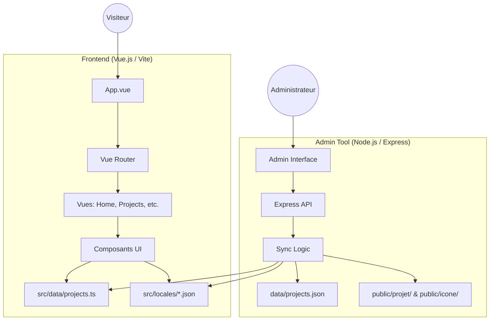
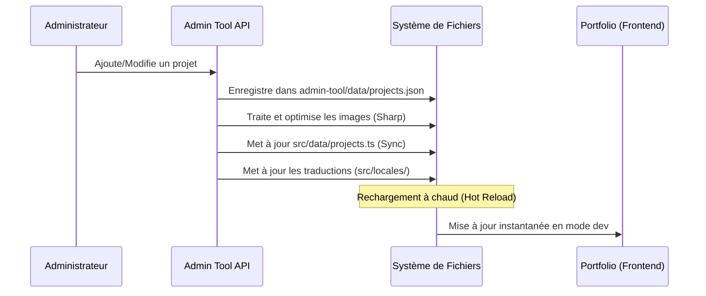

# 🚀 Portfolio de Développement

Ce projet est un portfolio moderne, interactif et multilingue conçu pour présenter des projets informatiques, des compétences et un parcours académique. Il intègre un outil d'administration dédié pour faciliter la gestion du contenu.

## 🌟 Fonctionnalités Clés

- **Interface Réactive :** Développée avec Vue 3 et Tailwind CSS.
- **Multilingue :** Support complet de plusieurs langues (FR, EN, DE, ES, IT, JP, RU, ZH) via `vue-i18n`.
- **Thème Sombre/Clair :** Gestion dynamique du thème.
- **Filtrage de Projets :** Tri par catégories (IA, Web, Logiciel, Jeux) et par objectifs.
- **Outil d'Administration :** Interface dédiée pour ajouter, modifier et supprimer des projets.
- **Optimisation des Images :** Conversion automatique en WebP et redimensionnement via l'outil d'admin.

---

## 🛠️ Stack Technique

### Frontend (Portfolio)
- **Framework :** [Vue.js 3](https://vuejs.org/) (Composition API)
- **Build Tool :** [Vite](https://vitejs.dev/)
- **Styling :** [Tailwind CSS](https://tailwindcss.com/)
- **Icons :** [Lucide Vue Next](https://lucide.dev/)
- **Internationalisation :** [Vue-i18n](https://vue-i18n.intlify.dev/)

### Outil d'Administration (Admin Tool)
- **Runtime :** Node.js
- **Serveur API :** Express
- **Traitement d'Image :** Sharp (pour la conversion WebP)
- **Gestion de Fichiers :** Multer
- **Interface UI :** Vue.js (CDN), Tailwind CSS, SortableJS (tri des images), Cropper.js (recadrage des logos).

---

## 🏗️ Architecture du Projet

Le projet est divisé en deux parties principales : le **Portfolio** (client final) et l'**Admin Tool** (gestion locale).



### Zoom sur l'Outil d'Administration

L'outil d'admin n'est pas qu'un simple éditeur de texte, il propose une expérience "Studio" complète :

1.  **Édition Multi-langue :** Onglets dédiés pour traduire chaque champ (nom, description, contexte, etc.) dans les 8 langues supportées.
2.  **Aperçu Temps Réel :** Une simulation de navigateur à droite de l'écran permet de visualiser le rendu exact du projet tel qu'il apparaîtra sur le site.
3.  **Gestion de Galerie :** Glisser-déposer pour réorganiser les images, téléchargement par lot.
4.  **Studio Photo Intégré :** Recadrage automatique du logo au format 1:1 avant l'upload.
5.  **Gestionnaire de Techs :** Interface pour ajouter de nouvelles technologies et leur icône associée.

### Flux de Synchronisation des Données

L'Admin Tool agit comme un pont entre une interface de saisie conviviale et les fichiers de données statiques consommés par le frontend.



---

## 🔧 Installation et Utilisation

### Prérequis
- [Node.js](https://nodejs.org/) (version 20+ recommandée)
- npm ou pnpm

### 1. Installation des dépendances
```bash
# Dans la racine du projet
npm install

# Dans le dossier admin-tool
cd admin-tool
npm install
cd ..
```

### 2. Lancement en développement
Pour lancer le portfolio et l'outil d'administration simultanément :
```bash
npm run dev:all
```
- **Portfolio :** `http://localhost:5173`
- **Admin Tool (Interface) :** `http://localhost:3000`

### 3. Build pour la production
```bash
npm run build
```
Le contenu sera généré dans le dossier `dist/`.

---

## 📂 Structure des Dossiers

- `admin-tool/` : Serveur Node.js et données de configuration de l'admin.
- `public/` : Assets statiques (images des projets, icônes, PDF).
- `src/` : Code source Vue.js.
  - `components/` : Composants réutilisables.
  - `data/` : Fichiers de données (notamment `projects.ts`).
  - `locales/` : Fichiers JSON de traduction.
  - `views/` : Pages principales du site.

---

## 📝 Licence
Ce projet est développé dans le cadre d'un parcours académique (BUT Informatique).
